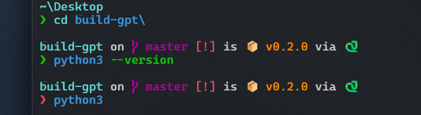
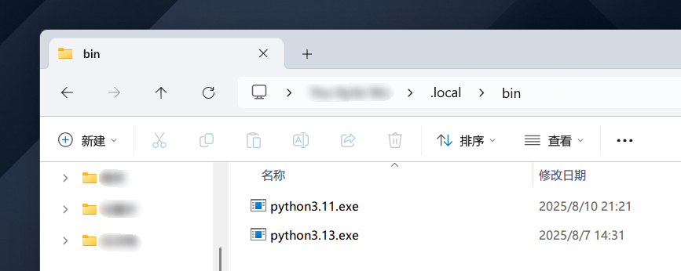
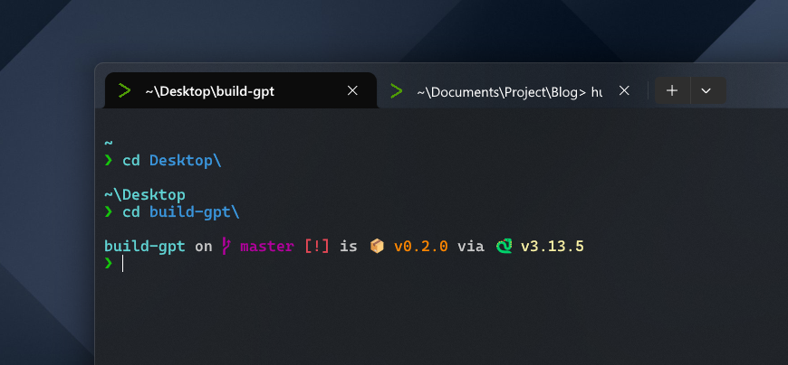

## 前言

- Starship 是一套高颜值 Shell 美化工具
- uv 是新一代 Python 包管理器，同时还支持安装 Python

目前遇到的问题是，在 Starship 当前版本中，Python 版本不能正常显示：



## 解决方案

首先，uv 在系统注册的环境变量是 `~/.local/bin` 目录：



所以在终端中输入 `python`、`python3` 等等都是不管用的。

借鉴另一个包管理器， Pixi 的配置方案。在 starship.toml 中配置 Python 指向虚拟环境的位置，而不是企图在整个系统环境变量中找到 Python。

1. 找到 Starship 的 toml 配置目录：

    ```bash
    starship config
    ```

2. 添加以下内容：

    ```toml
    [python]
    # customize python binary path for uv
    python_binary = [
      "python",
      # fall back to uv's python if it's available
      ".venv/Scripts/python",
    ]
    ```

需要注意的是，`.venv/Scripts/python` 目录只适用于 Windows，如果是 Mac / Linux 应大概是 `.venv/bin/python`，需读者自己查证。

## 修复效果


